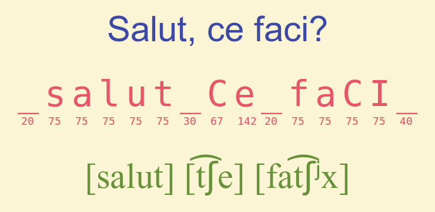

# This repository has been moved to [gitlab.com/paul-nechifor/romsun](http://gitlab.com/paul-nechifor/romsun).

Old readme:

# Romsun

This is a Romanian text to phoneme converter.

Back in 2009 I couldn't find any free text-to-speech library for Romanian, but I
did find that the [MBROLA speech synthesizer][1] supported reading Romanian
phonemes so I wrote this to transform Romanian text to the `.pho` files needed
by MBROLA.

It's not that good, but it's better than nothing. I used it for awesome things
like reading the instant messages I get from people (a Pidgin module), counting
sheep in Romanian so I can go to sleep faster, getting audio notifications of
when a website gets updated... I mean, really, Nobel prize material.

## Install

Get `mbrola` and `sox` (console WAV player). Possibly others too.

    sudo apt-get install mbrola sox unzip

Get the `ro1` voice:

    wget 'http://tcts.fpms.ac.be/synthesis/mbrola/dba/ro1/ro1-980317.zip'
    unzip -p ro1-*.zip ro1/ro1 > ro1
    rm ro1-*.zip

## Usage

Once you have those you can use the `spune` Bash script.

    ./spune 'Eu zic că se aude destul de bine.'

For the actual program see the help:

    ./romsun.py -h

## License

MIT

[1]: http://en.wikipedia.org/wiki/MBROLA
